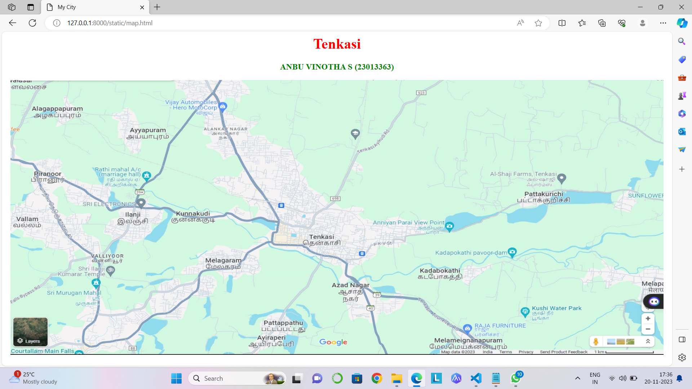
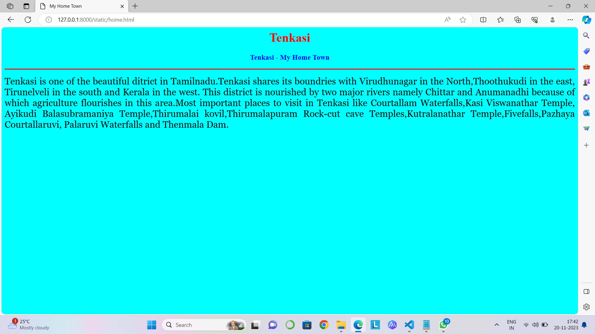
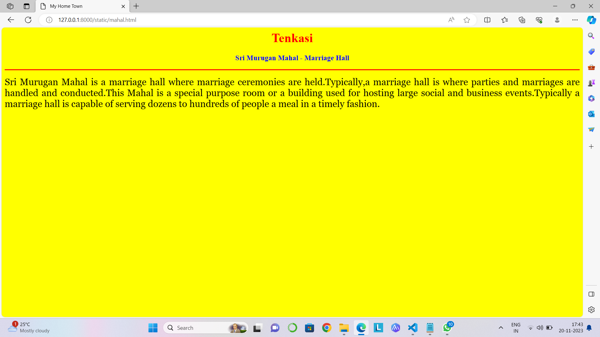
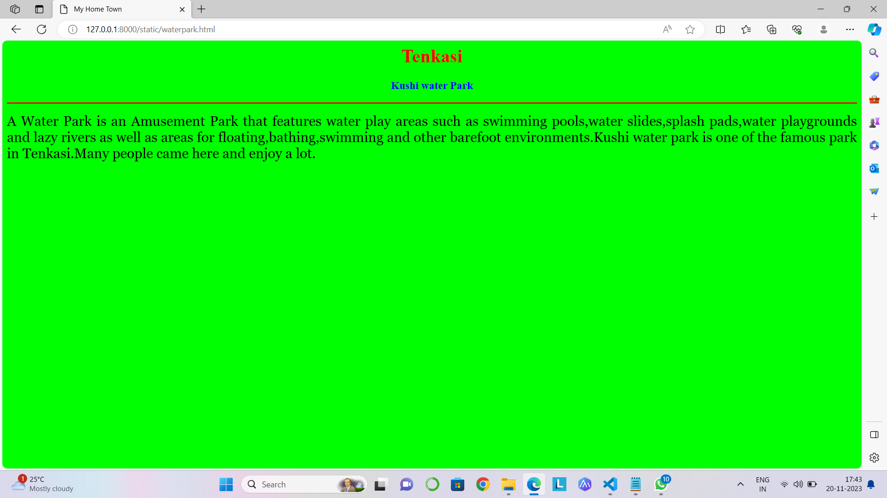
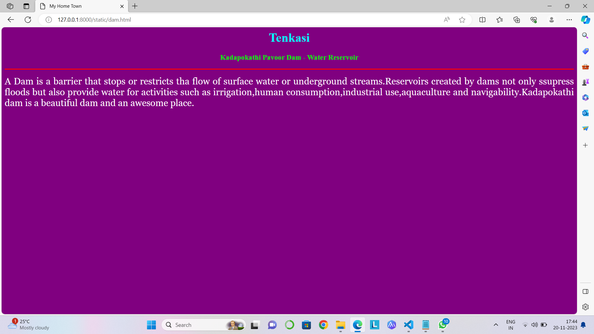
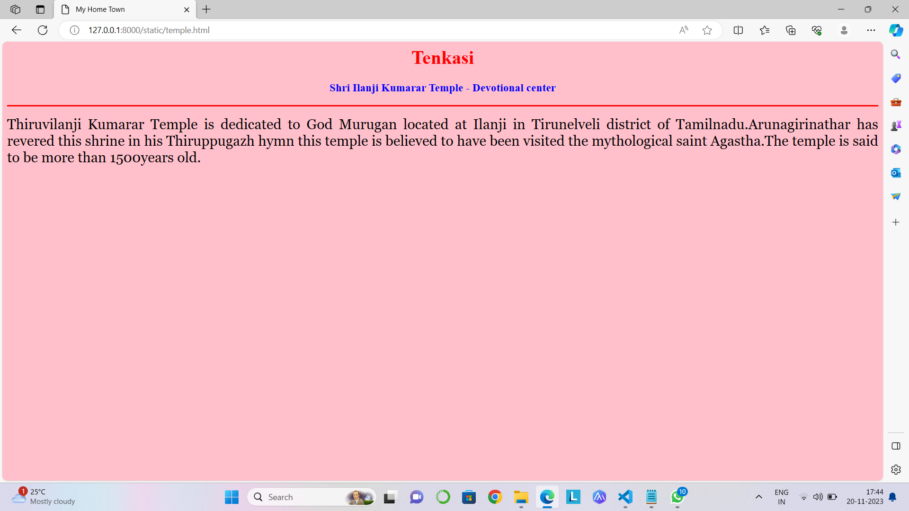

# Ex04 Places Around Me
## Date: 20.11.23

## AIM
To develop a website to display details about the places around my house.

## DESIGN STEPS

### STEP 1
Create a Django admin interface.

### STEP 2
Download your city map from Google.

### STEP 3
Using ```<map>``` tag name the map.

### STEP 4
Create clickable regions in the image using ```<area>``` tag.

### STEP 5
Write HTML programs for all the regions identified.

### STEP 6
Execute the programs and publish them.

## CODE
```
<html>
<head>
<title>My City</title>
</head>
<body>
<h1 align="center">
<font color="red"><b>Tenkasi</b></font>
</h1>
<h3 align="center">
<font color="green"><b> ANBU VINOTHA S (23013363)</b></font>
</h3>
<center>

<map name="MyCity">
<area shape="rect" coords="600,250,800,400" href="home..html" title="My Home Town">
<area shape="rect" coords="100,450,300,600" href="mahal.html" title="Sri Murugan Mahal ">
<area shape="rect" coords="1100,300,1400,800" href="waterpark.html" title="Kushi Water Park">
<area shape="rect" coords="900,350,1100,500" href="dam.html" title="Kadapokathi Pavoor Dam">
<area shape="rect" coords="100,400,300,500" href="temple.html" title="Shri Ilanji Kumarar Temple">
</map>
</center>
</body>
</html>

home.html
<html>
<head>
<title>My Home Town</title>
</head>
<body bgcolor="cyan">
<h1 align="center">
<font color="red"><b>Tenkasi</b></font>
</h1>
<h3 align="center">
<font color="blue"><b>Tenkasi - My Home Town</b></font>
</h3>
<hr size="3" color="red">
<p align="justify">
<font face="Georgia" size="5">
Tenkasi is one of the beautiful ditrict in Tamilnadu.Tenkasi shares its boundries with Virudhunagar in the North,Thoothukudi in the east,
Tirunelveli in the south and Kerala in the west. This district is nourished by two major rivers namely Chittar and Anumanadhi because of
which agriculture flourishes in this area.Most important places to visit in Tenkasi like Courtallam Waterfalls,Kasi Viswanathar Temple,
Ayikudi Balasubramaniya Temple,Thirumalai kovil,Thirumalapuram Rock-cut cave Temples,Kutralanathar Temple,Fivefalls,Pazhaya Courtallaruvi,
Palaruvi Waterfalls and Thenmala Dam.
</font>
</p>
</body>
</html>

mahal.html
<html>
<head>
<title>My Home Town</title>
</head>
<body bgcolor="yellow">
<h1 align="center">
<font color="red"><b>Tenkasi</b></font>
</h1>
<h3 align="center">
<font color="blue"><b>Sri Murugan Mahal - Marriage Hall</b></font>
</h3>
<hr size="3" color="red">
<p align="justify">
<font face="Georgia" size="5">
Sri Murugan Mahal is a marriage hall where marriage ceremonies are held.Typically,a marriage hall is where parties and marriages are
handled and conducted.This Mahal is a special purpose room or a building used for hosting large social and business events.Typically a
marriage hall is capable of serving dozens to hundreds of people a meal in a timely fashion.
</font>
</p>
</body>
</html>

waterpark.html
<html>
<head>
<title>My Home Town</title>
</head>
<body bgcolor="yellow">
<h1 align="center">
<font color="red"><b>Tenkasi</b></font>
</h1>
<h3 align="center">
<font color="blue"><b>Sri Murugan Mahal - Marriage Hall</b></font>
</h3>
<hr size="3" color="red">
<p align="justify">
<font face="Georgia" size="5">
Sri Murugan Mahal is a marriage hall where marriage ceremonies are held.Typically,a marriage hall is where parties and marriages are
handled and conducted.This Mahal is a special purpose room or a building used for hosting large social and business events.Typically a
marriage hall is capable of serving dozens to hundreds of people a meal in a timely fashion.
</font>
</p>
</body>
</html>

dam.html
<html>
<head>
<title>My Home Town</title>
</head>
<body bgcolor="purple">
<h1 align="center">
<font color="cyan"><b>Tenkasi</b></font>
</h1>
<h3 align="center">
<font color="lime"><b>Kadapokathi Pavoor Dam - Water Reservoir</b></font>
</h3>
<hr size="3" color="red">
<p align="justify">
<font face="Georgia" size="5" color="white">
A Dam is a barrier that stops or restricts tha flow of surface water or underground streams.Reservoirs created by dams not only ssupress floods but also provide water for activities such as irrigation,human consumption,industrial use,aquaculture and navigability.Kadapokathi dam is a beautiful dam and an awesome place.
</font>
</p>
</body>
</html>

temple.html
<html>
<head>
<title>My Home Town</title>
</head>
<body bgcolor="pink">
<h1 align="center">
<font color="red"><b>Tenkasi</b></font>
</h1>
<h3 align="center">
<font color="blue"><b>Shri Ilanji Kumarar Temple - Devotional center</b></font>
</h3>
<hr size="3" color="red">
<p align="justify">
<font face="Georgia" size="5">
Thiruvilanji Kumarar Temple is dedicated to God Murugan located at Ilanji in Tirunelveli district of Tamilnadu.Arunagirinathar has revered this shrine in his Thiruppugazh hymn this temple is believed to have been visited the mythological saint Agastha.The temple is said to be more than 1500years old.
</font>
</p>
</body>
</html>
```
## OUTPUT








## RESULT
The program for implementing image maps using HTML is executed successfully.
